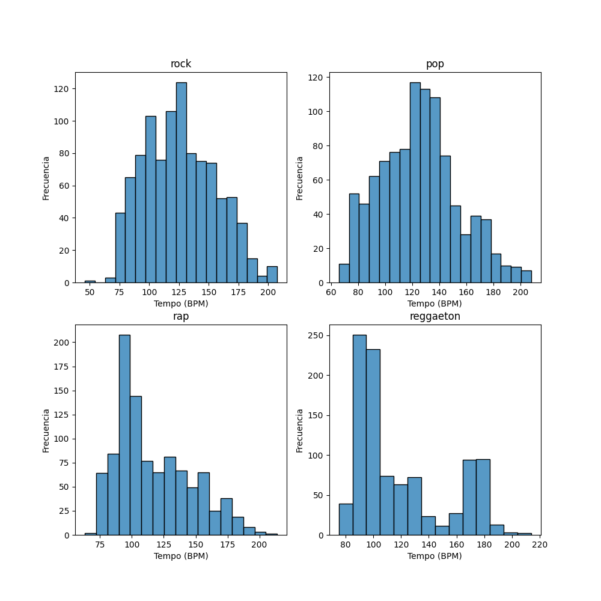
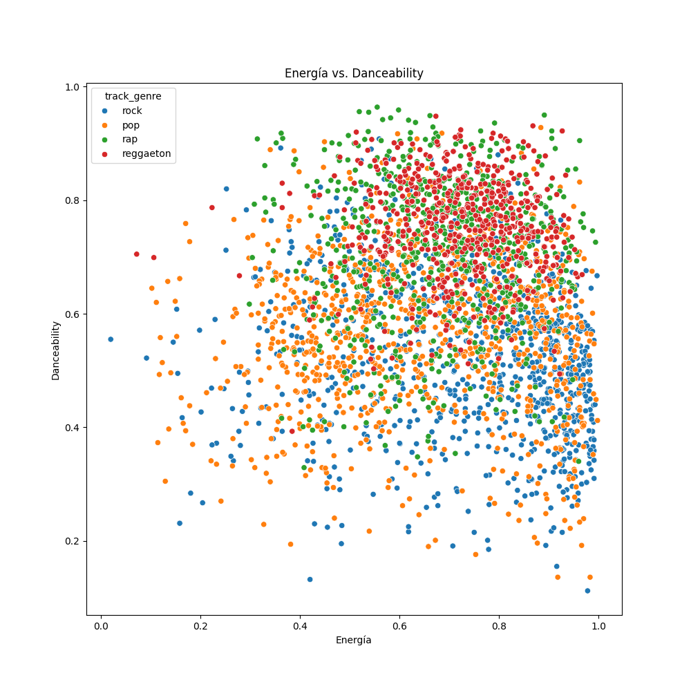
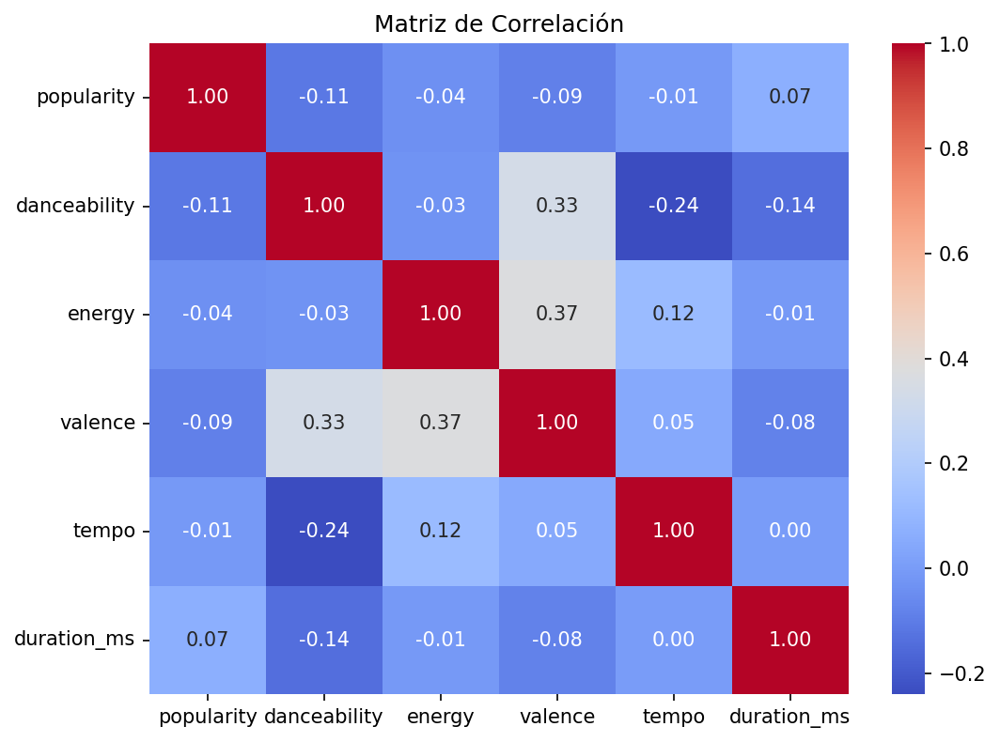
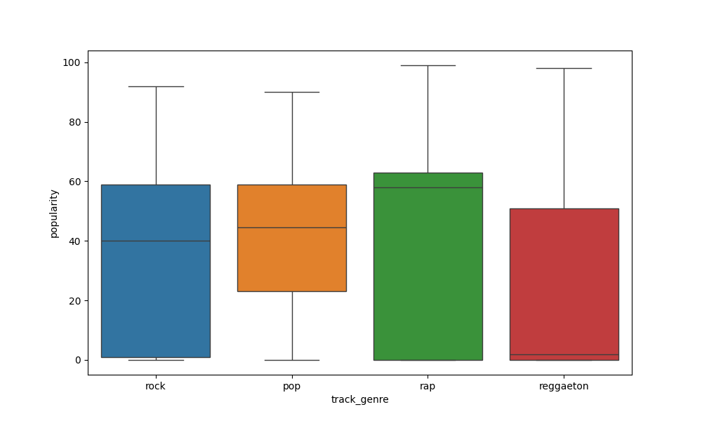
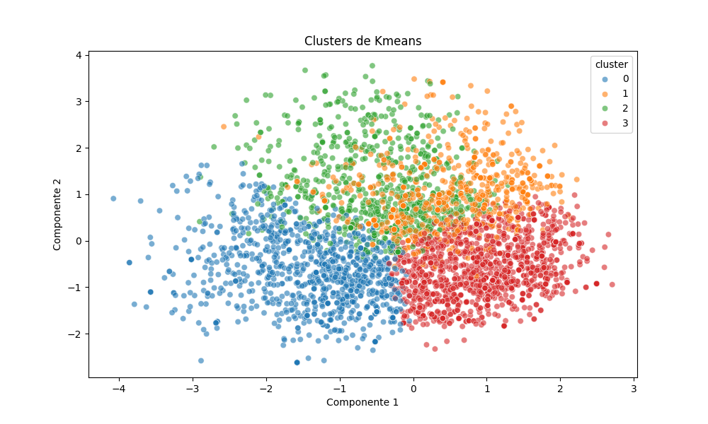

# 🎵 Spotify Music Analysis

Análisis de 3.432 canciones de Spotify para descubrir qué características
tienen las canciones más populares y encontrar agrupaciones naturales entre géneros.

## 📌 Objetivo

Responder a la pregunta: **¿Qué hace que una canción sea popular en Spotify?**

Analizando 4 géneros musicales — rock, pop, rap y reggaeton — usando
estadísticas descriptivas, visualizaciones y Machine Learning (K-Means + PCA).

---

## 🛠️ Tecnologías

- Python 3.14
- Pandas
- NumPy
- Matplotlib
- Seaborn
- Scikit-learn
- Spotipy
- Jupyter Notebook

---

## 📁 Estructura del Proyecto
```
spotify-music-analysis/
├── data/
│   ├── raw/                  # Datos extraídos de Spotify API
│   └── processed/            # Dataset limpio y balanceado
├── notebooks/
│   └── 01_exploratory_analysis.ipynb  # Análisis exploratorio completo
├── src/
│   ├── extract.py            # Extracción de datos via Spotify API
│   ├── transform.py          # Limpieza y procesamiento
│   ├── analysis.py           # K-Means y PCA
│   └── visualize.py          # Generación de gráficos
├── visualizations/           # Gráficos exportados
└── README.md
```

---

## 📊 Dataset

- **Fuente:** Kaggle — `maharshipandya/spotify-tracks-dataset`
- **Canciones:** 3.432 (balanceadas, 858 por género aproximadamente)
- **Géneros:** Rock, Pop, Rap, Reggaeton
- **Variables:** `popularity`, `danceability`, `energy`, `valence`, `tempo`, `duration_ms`, `explicit`

> ⚠️ El endpoint `audio_features` de Spotify fue deprecado en noviembre 2024
> para apps nuevas. El dataset fue obtenido de Kaggle para disponer de estas
> variables en el análisis.

---

## 🚀 Cómo Ejecutarlo

**1. Clona el repositorio**
```bash
git clone https://github.com/tu-usuario/spotify-music-analysis.git
cd spotify-music-analysis
```

**2. Crea el entorno virtual e instala dependencias**
```bash
python -m venv .venv
source .venv/bin/activate  # Mac/Linux
pip install pandas numpy matplotlib seaborn scikit-learn spotipy python-dotenv jupyter
```

**3. Configura las credenciales de Spotify**

Crea un archivo `.env` en la raíz del proyecto:
```
SPOTIPY_CLIENT_ID=tu_client_id
SPOTIPY_CLIENT_SECRET=tu_client_secret
```

**4. Ejecuta los scripts en orden**
```bash
python src/extract.py      # Extrae datos de Spotify
python src/transform.py    # Limpia el dataset
python src/analysis.py     # K-Means y PCA
python src/visualize.py    # Genera los gráficos
```

**5. Abre el notebook**
```bash
jupyter notebook notebooks/01_exploratory_analysis.ipynb
```

---

## 📈 Resultados

### Popularidad media por género

| Género | Popularidad media |
|---|---|
| Rap | 45.6 ⭐ |
| Pop | 41.3 |
| Rock | 38.7 |
| Reggaeton | 31.0 |

### Conclusiones principales

- **Ninguna variable de audio tiene correlación fuerte con la popularidad.**
  La popularidad depende más de factores externos como el artista, el marketing
  y la época que de características como `danceability` o `energy`.

- **Rock y Pop son separables por características de audio.** K-Means los
  agrupa correctamente sin conocer las etiquetas de género.

- **Rap y Reggaeton son difíciles de separar.** Comparten valores similares
  de `danceability`, `energy`, `valence` y `tempo`, lo que confirma su
  similitud sonora.

- **Reggaeton es el género más desigual.** La mayoría de canciones son
  desconocidas, pero los superéxitos alcanzan popularidad de 97/100.

- **El tempo a doble velocidad es un error conocido de Spotify.** Las
  canciones de reggaeton muestran un segundo pico en ~180 BPM causado
  por detección incorrecta del algoritmo de audio.

---

## 📉 Visualizaciones

### Distribución de Tempo por Género


### Energía vs. Danceability


### Matriz de Correlaciones


### Popularidad por Género


### K-Means Clusters (PCA)


---

## ⚠️ Limitaciones

- El dataset proviene de Kaggle y puede tener sesgo hacia el mercado anglosajón,
  lo que explica la baja popularidad del reggaeton respecto a su impacto global real.
- `audio_features` de Spotify está deprecado para apps nuevas desde noviembre 2024.
- K-Means asume clusters esféricos y puede no capturar la complejidad real
  de los géneros musicales.

---

## 👤 Autor

**Filipi Henrique**
Junior Python Developer | Data Analyst
[GitHub](https://github.com/Powfip)